# An aMAZEng homepage

Lost in a sprawling maze, a young scout needs your help to find the way out.

Imagine being trapped in a vast, twisting labyrinth - walls closing in, every turn a mystery, every step a gamble.
That’s exactly where a young scout finds himself.

Welcome to aMAZEng, where every maze is a fresh challenge packed with surprises:
* Sneaky traps that test your vigilance;
* Mysterious portals warping you to unknown corners;
* Locked doors begging for clever solutions.

Will you rely on luck, darting blindly through the corridors?
Or will you craft a strategy - maybe stick to the right-hand rule, or sketch a mental map to unveil the maze’s secrets?

Here’s what awaits you:
* 100 unique mazes - from deceptively simple to mind‑bendingly complex;
* No internet needed - play anytime, anywhere;
* Zero ads - just pure, uninterrupted puzzle‑solving fun.

Dare to get lost?
Download aMAZEng and discover if you’ve got what it takes to escape!

### Find aMAZEng at
* [YouTube Promo Videos](https://www.youtube.com/playlist?list=PLKUSt_OFstuyi2PSv1t3yXA586KpwRxTD)
* [YouTube Music](https://www.youtube.com/playlist?list=PLKUSt_OFstuxojpi9MoRBqhPYh5bueH1s)
* [Google Play](https://play.google.com/store/apps/details?id=ru.d_shap.ap.amazeng)

### Screenshots

#### World 1
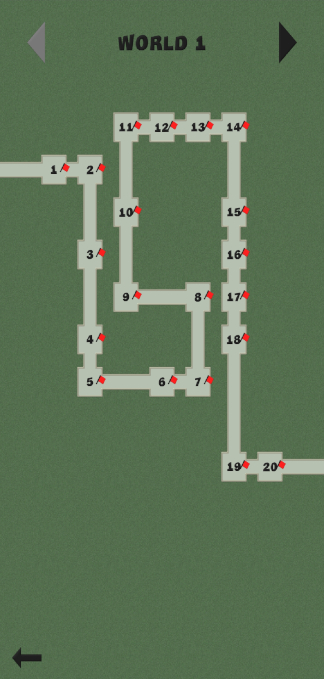
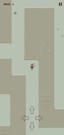
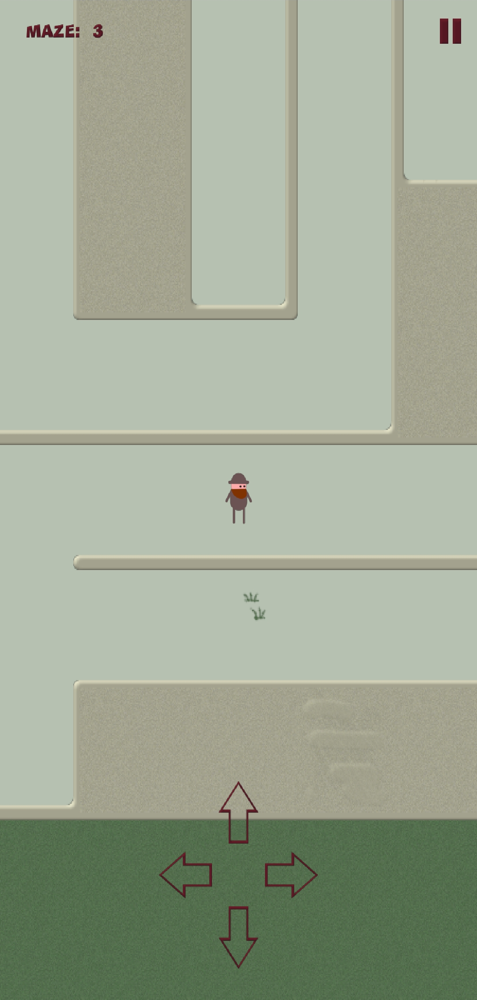
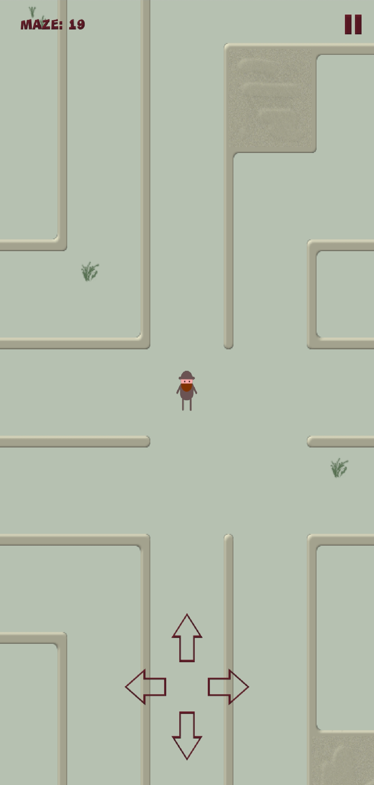
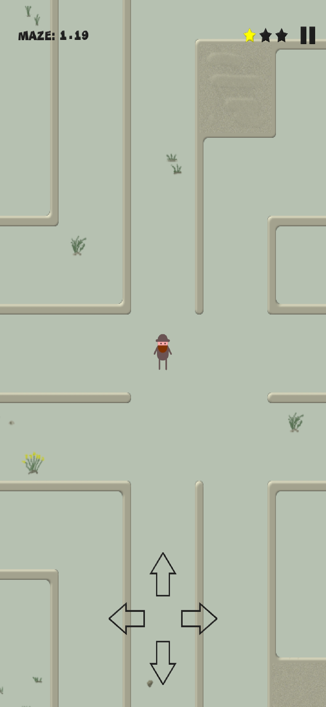

#### World 2
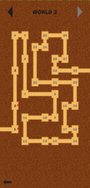
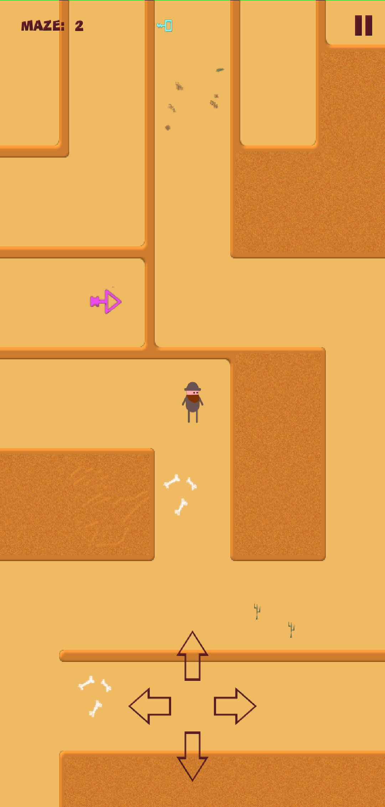
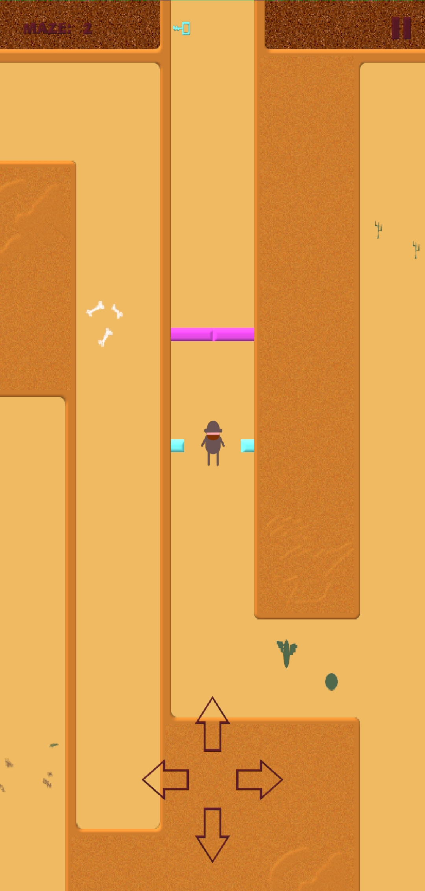
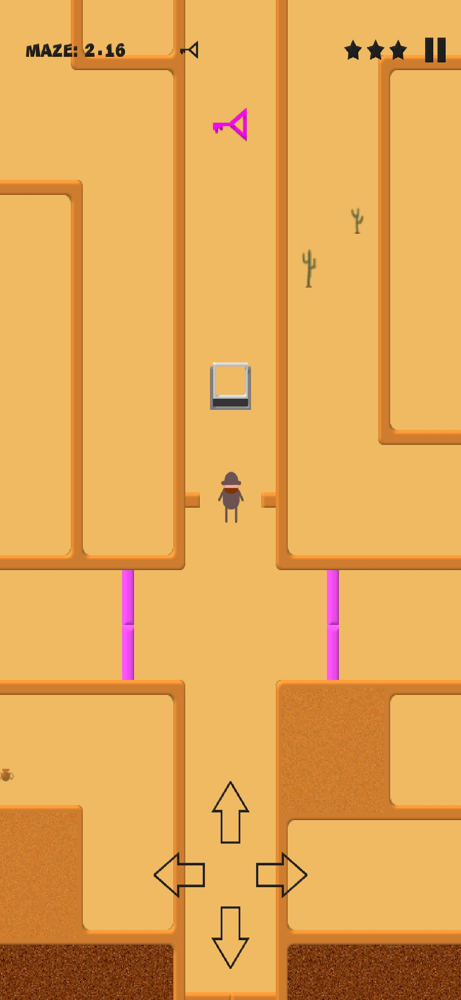
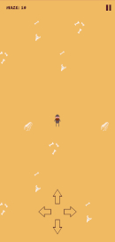

#### World 3
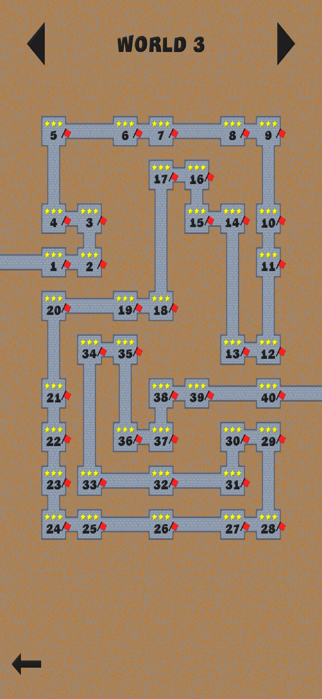
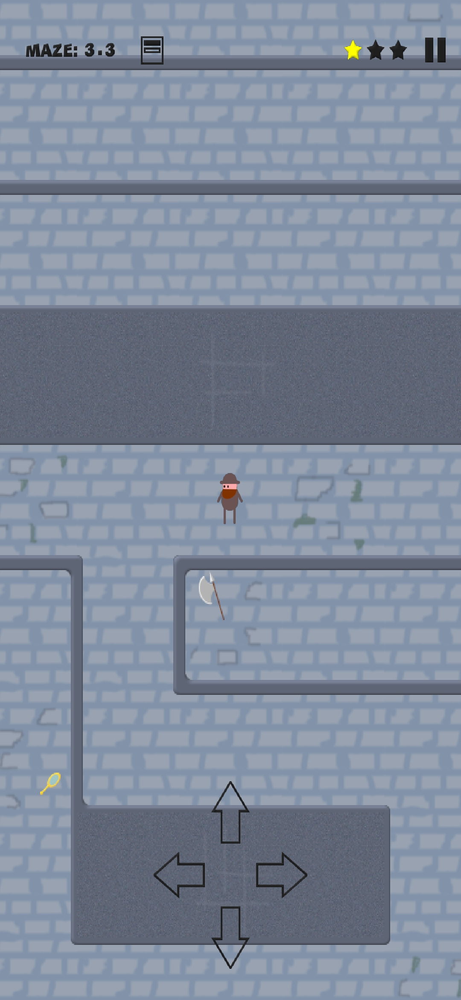
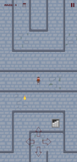
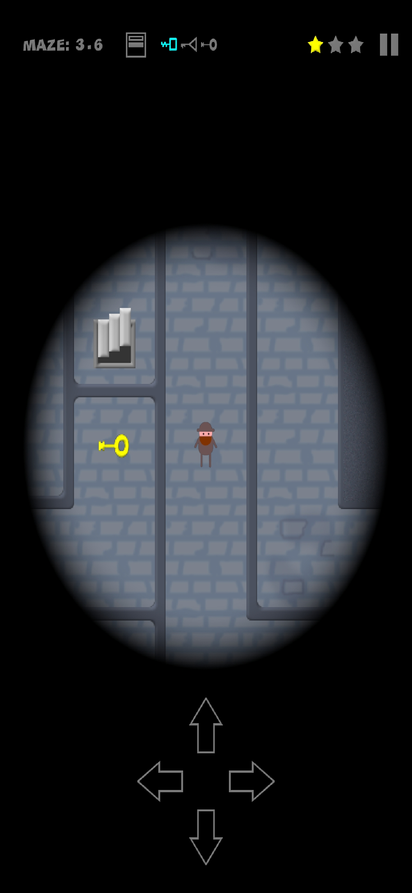
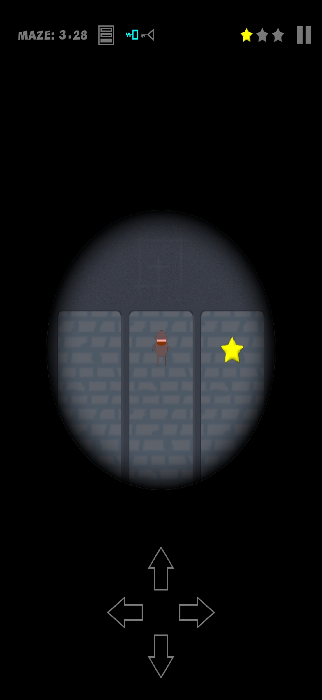

#### World 4

#### World 5
Under development

# Personal data

This game does not collect any personal data itself.
But it uses Android APIs and authenticates user at Google Play Services.
Google Play Services are used for achievements.

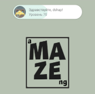
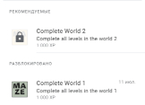

[Privacy Policy](./PrivacyPolicy.md)
