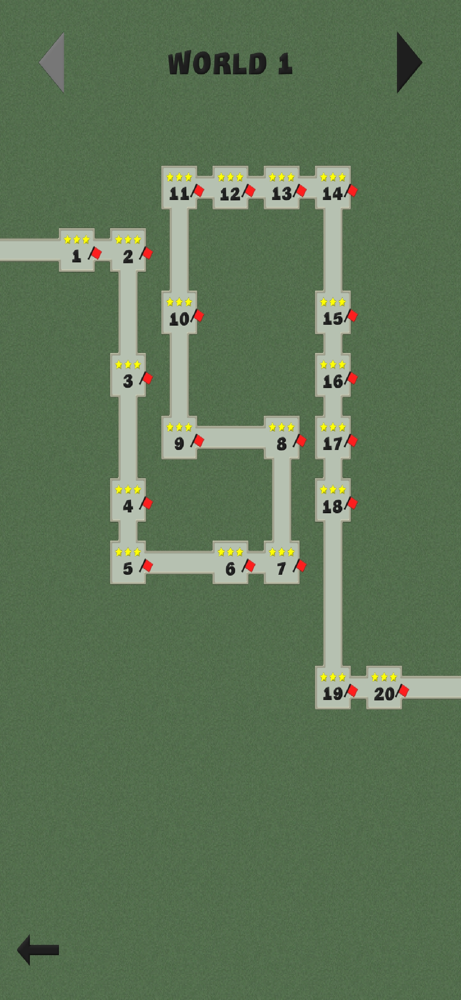
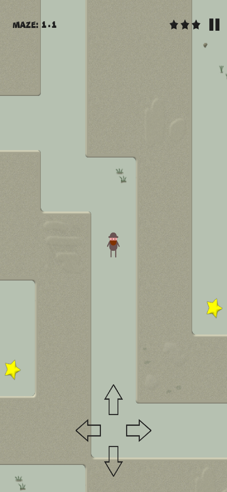
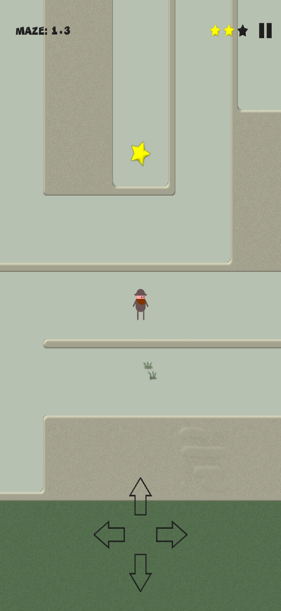
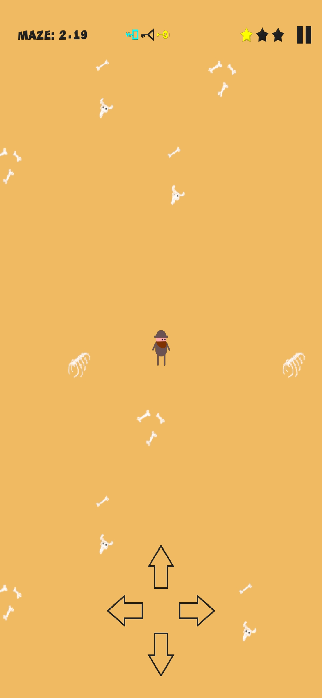
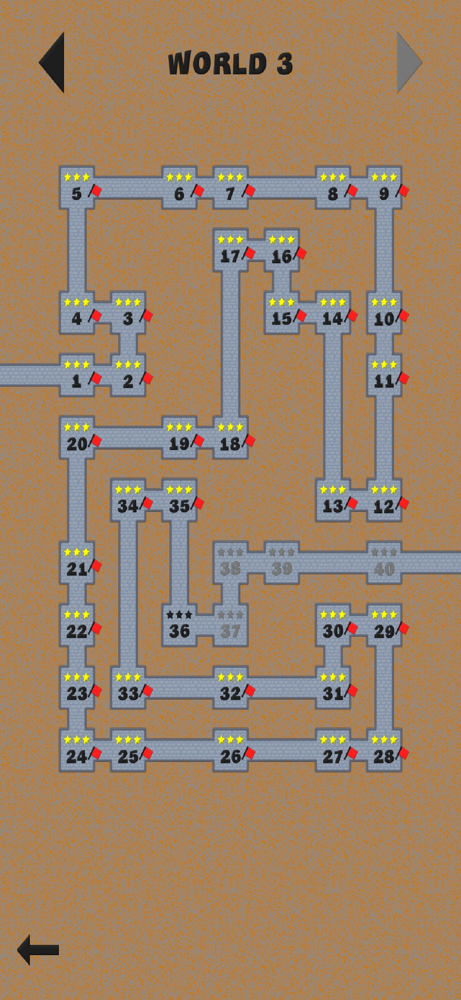
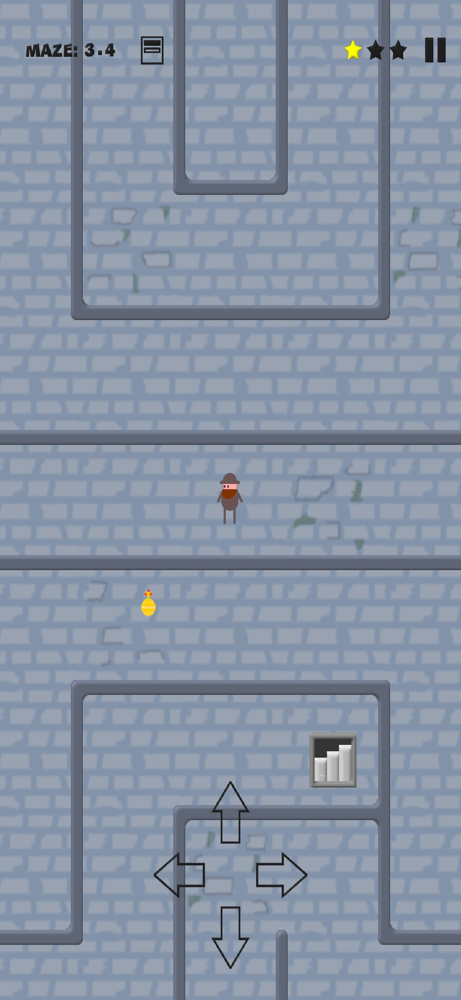

# An aMAZEng homepage

A boy scout is lost in a maze.
Help him to find a way out.

Mazes are large and confusing, with lots of obstacles such as closed doors, traps and portals.
You will have to work hard to overcome these obstacles and find a way out.

Is it possible to find an exit by randomly choosing passages?\
Or is it better to use some rules to pass a maze, for example a right-hand rule - move through a maze so that your right hand always touches a wall.\
Or you can try to create a maze's plan so you will see a bigger picture of a maze.\
Or is there some easier way?

* 80 mazes available
* Lots of obstacles - closed doors, traps and portals
* No internet connection required
* No adds

### Screenshots

#### World 1

#### World 2

#### World 3

#### World 4
Under development

#### World 5
Under development

# Personal data

This game does not collect any personal data itself.
But it uses Android APIs and authenticates user at Google Play Services.
Google Play Services are used for achievements.

[Privacy Policy](./PrivacyPolicy.md)
